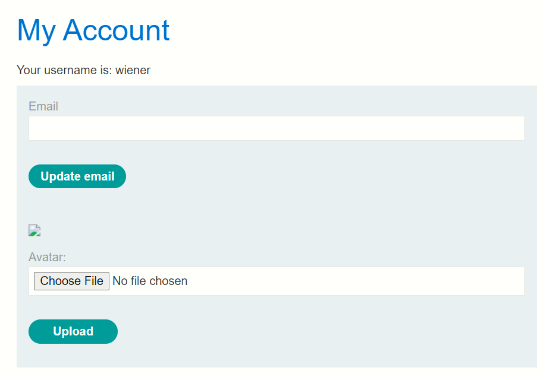
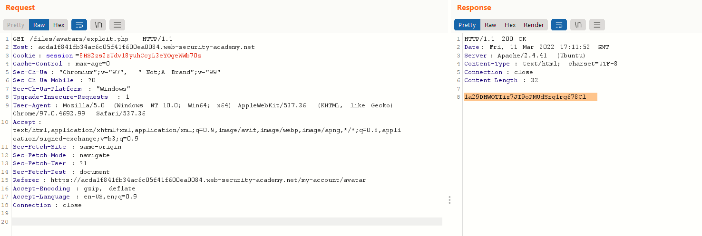

# # Lab: Remote code execution via web shell upload

> Phòng lab này chứa lỗ hổng file upload trong phần upload avatar. 
> 
> Để giải quyết phòng lab, hãy tải lên một web shell PHP cơ bản và sử dụng nó để lấy nội dung của file mật `/home/carlos/secret`. Gửi nội dung lấy được bằng nút **Submit**
>
> Hãy đăng nhập vào account `wiener:peter` để upload avatar

Sau khi đăng nhập vào account thì mình thấy trang web hiển thị 

>

Vậy thì ở đây chắc chắn là lỗ hổng file upload mà mình cần nghiên cứu. 

Thử upload ảnh bình thường thì trang web header đến 1 đường link thông báo rằng đã upload thành công và vị trí đặt file ảnh

`The file avatars/d1758efe0f0efc50a51f33.jpg has been uploaded.`

Do đề bài yêu cầu upload 1 file php đọc được bí mật của carlos gì gì đó nên tạo 1 file php đặt tên là exploit.php với nội dung 

> `<?php echo  file_get_contents('/home/carlos/secret'); ?>`

Với hàm `file_get_contents` để lấy nội dung file và echo để hiển thị ra màn hình. Sau khi upload thành công file thì trang web thông báo vị trí đặt file của mình `avatars/exploit.php`. Đã biết được vị trí file, bây giờ mình bật Burp để bắt request và sử dụng repeater để chỉnh sửa GET request đến file php mình vừa up.

>

Và mình có được đoạn secret kia rùi đem đi kể cho mọi người thôi :))