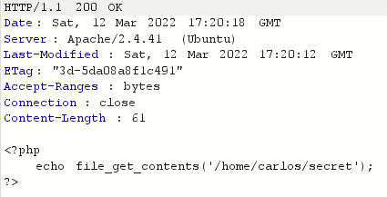

# Lab: Web shell upload via path traversal

> Phòng lab này chứa lỗ hổng file upload trong phần upload avatar. Lỗ hổng này không thể khai thác trực tiếp nhưng có thể khai thác gián tiếp thông qua lỗ hổng thứ cấp **Path traversal**
> 
> Để giải quyết phòng lab, hãy tải lên một web shell PHP cơ bản và sử dụng nó để lấy nội dung của file mật `/home/carlos/secret`. Gửi nội dung lấy được bằng nút **Submit**
>
> Hãy đăng nhập vào account `wiener:peter` để upload avatar

Thử upload file exploit.php với nội dung `<?php echo file_get_contents('/home/carlos/secret') ?>` thì nhận thấy trang web không hề chặn việc mình tải lên file .php. 

Nhưng có thực thi được hay không thì lại là một vấn đề khác. Lúc này mình bắt request bằng burp và sửa `GET /files/avatars/exploit.php` thì thấy trang web trả về file php mà mình tải lên dưới dạng string tức là dòng code của mình không được thực thi vì nó đã bị trả về dưới dạng text. 

>

Vậy là trang web đã chặn mình thực thi code trong folder `/avatar` này. Điều mình cần làm lúc này là di chuyển file code ra folder cha là `/files`

Để làm được điều này thì cần tận dụng lỗ hổng **Path traversal** để lưu file .php vào đường dẫn `files/avatars/../exploit.php`.  Để ý thấy đường dẫn file là `files/avatars/<tên_file>` nên để tạo được đường dẫn như mong muốn thì mình cần đặt tên file là `../exploit.php`.

Thử đặt tên file như trên thì trang web phản hồi `The file avatars/exploit.php has been uploaded`. Vậy là trang web đã lọc đầu vào để loại bỏ các ký tự `../` nhằm ngăn chặn path traversal. Mã hóa URL các ký tự trên thành `..%2f` để bypass  bộ lọc thì trang web trả về phản hồi `The file avatars/../exploit.php has been uploaded`. Điều này chỉ ra rằng tên tệp đang được máy chủ giải mã URL. 

Thử request `GET files/avatars/../exploit.php` thì nhận được bí mật của Carlos :> Điều này cho thấy rằng tệp đã được tải lên một thư mục cao hơn trong phân cấp hệ thống tệp (/file) và sau đó được thực thi bởi máy chủ. 

Lưu ý rằng điều này đồng nghĩa với việc bạn cũng yêu cầu tệp này bằng cách sử dụng `GET /files/exploit.php`.

 